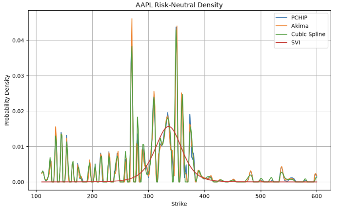

# Option-Implied Risk-Neutral Distribution Analytics

A quantitative finance library for constructing implied volatility smiles, calibrating parametric volatility models, recovering option-implied risk-neutral probability distributions, and validating numerical methods used in option analytics.



---

## Features

- Black-Scholes option pricing
- Implied volatility solver
- Yahoo Finance option chain ingestion
- Option quote cleaning and validation
- Static arbitrage checks
- Implied volatility smile construction
- Multiple smile interpolation methods
  - PCHIP
  - Akima
  - Cubic Spline
- SVI volatility smile calibration
- Breeden–Litzenberger risk-neutral density extraction
- Numerical validation notebooks
- Comprehensive unit test suite

---

## Pipeline

```text
Yahoo Finance
      │
      ▼
 Option Chain
      │
      ▼
 Cleaning & Validation
      │
      ▼
 Implied Volatility
      │
      ▼
 Volatility Smile
      │
 ┌────┴──────────┐
 ▼               ▼
Interpolation | SVI
      │
      ▼
Black-Scholes Pricing
      │
      ▼
Breeden–Litzenberger
      │
      ▼
Risk-Neutral Density
```

---

## Numerical Validation

The Breeden–Litzenberger implementation has been validated using a controlled constant-volatility Black–Scholes benchmark.

Key findings:

- Constant volatility recovers a smooth risk-neutral density with total probability ≈ **1.000000**
- Generic smile interpolation (PCHIP, Akima and Cubic Spline) accurately reproduces market implied volatilities but produces unstable second derivatives when numerically differentiated
- The resulting recovered densities exhibit probability mass greater than one, demonstrating that the limitation lies in the smoothness of the volatility representation rather than the Breeden–Litzenberger implementation itself

These experiments establish the correctness of the numerical differentiation pipeline while motivating the use of arbitrage-aware parametric volatility models such as **SVI** for stable density recovery.

---

## Roadmap

### Phase 1 — Prototype

- [x] Black-Scholes pricing
- [x] Implied volatility solver
- [x] Option chain ingestion
- [x] Data cleaning
- [x] Static arbitrage validation
- [x] Implied volatility smile construction
- [x] Smile interpolation
- [x] SVI volatility smile calibration
- [x] Breeden–Litzenberger density extraction
- [x] Numerical validation

### Phase 2 — Research

- [x] SVI case study
- [x] Stable market-implied density recovery using calibrated SVI

Future Plan:
- [ ] Arbitrage-free volatility surface
- [ ] Distribution analytics
- [ ] Density moments (mean, variance, skewness, kurtosis)
- [ ] Local volatility extraction
- [ ] Interactive visualizations
- [ ] Documentation website

---

## Repository Structure

```text
src/
├── cleaning/
├── data/
├── density/
├── models/
├── pricing/
├── volatility/
└── utils/

tests/
notebooks/
```

---

## Current Status

**Version:** Prototype Complete (v1)

The core option analytics pipeline has been implemented and validated.

Current research focuses on evaluating **SVI** as an arbitrage-aware volatility parameterization for improving the numerical stability of Breeden–Litzenberger risk-neutral density recovery.

---

## Development

### Install dependencies

```bash
poetry install
```

### Activate environment

```bash
poetry shell
```

### Run tests

```bash
poetry run pytest
```

### Run notebooks

```bash
poetry run jupyter lab
```

### Add dependency

```bash
poetry add <package>
```

### Add development dependency

```bash
poetry add --group dev <package>
```
